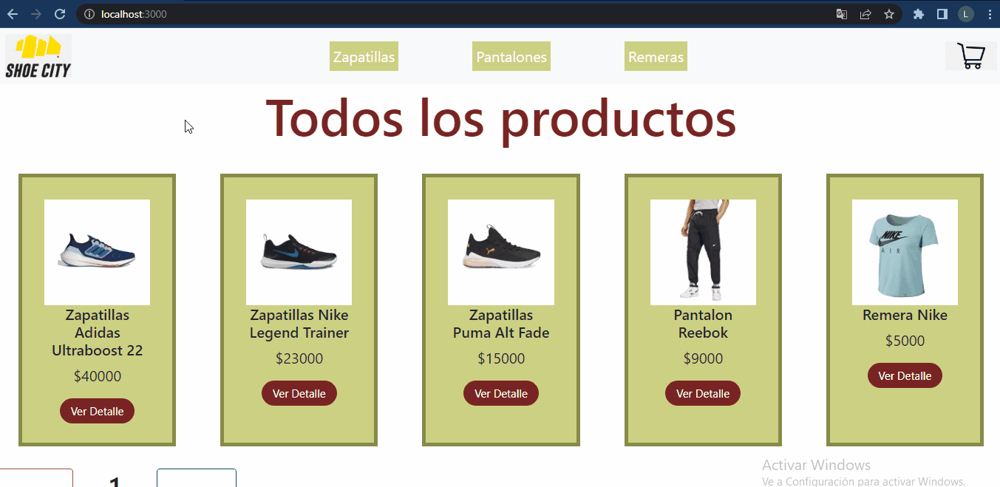

¡Bienvenido!

Este es mi e-commerce, una tienda de ropa y calzado deportivo.

Para inicializar este proyecto es necesario clonarlo, ejecutar npm install y luego ejecutar npm start, para poder visualizarlo en el localhost:3000.

El proyecto incluye un archivo asyncmock.js que funciona como una simulacion de base de dato, que contiene el listado de productos de la tienda, y al final tiene desarrolladas algunas funciones asincronas con las que obtenemos esos productos en el formato necesario para utilizarlos en los componenetes ademas de filtrarlos, etc., con un pequeño retardo para asi simular un pedido a una API.

El archivo App.js es el mas importante ya que contiene los componentes principales y donde parten todas las rutas.

- La primer ruta '/' renderiza el componente ItemListContainer, que nos muestra el listado de productos con sus respectivas cards.

- La segunda ruta '/categoria/:categoriaId' tambien nos muestra el listado de productos mediante el ItemListContainer, pero esta vez filtrando los elementos de acuerdo a sus categorias pulsando los botones ubicados en el NavBar.

- Por ultimo, la tercer ruta '/detail/:productId' nos trae el componente ItemDetailContainer, que nos permite acceder al detalle de cada uno de los productos presionando los botones "Ver Detalle" en las cards.

